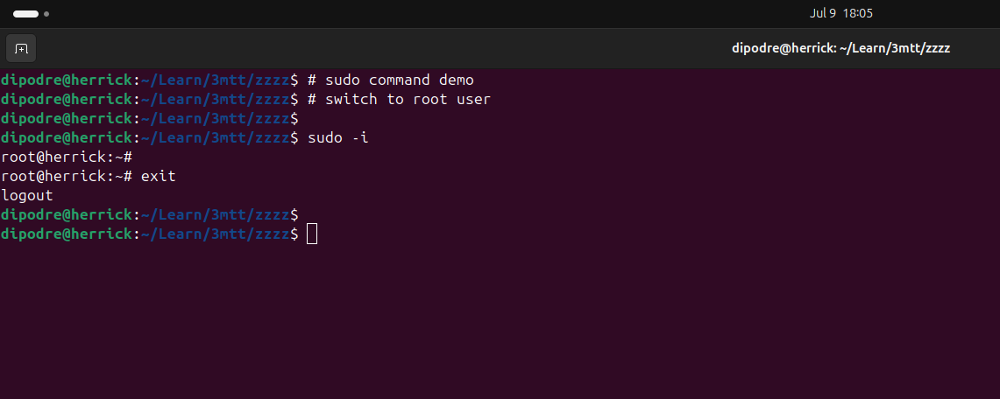
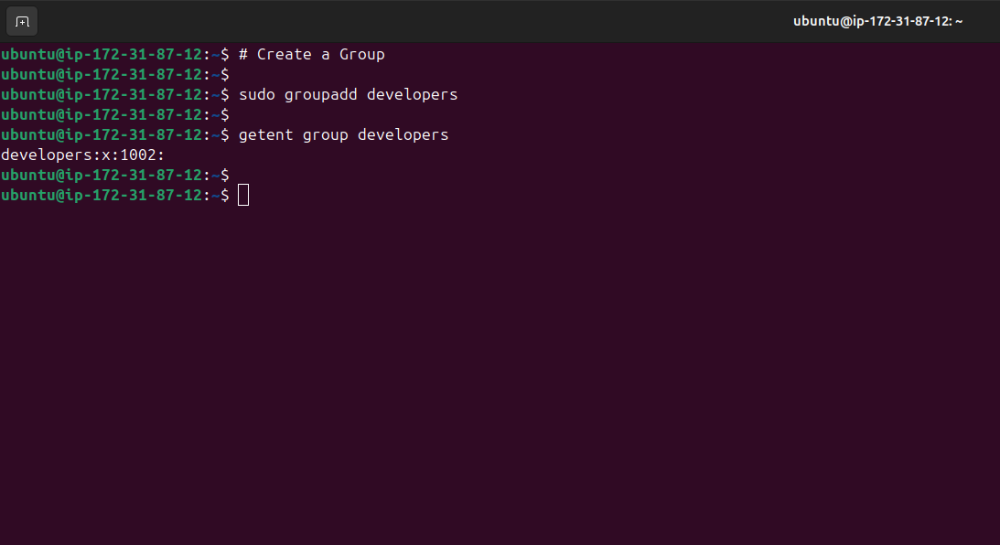
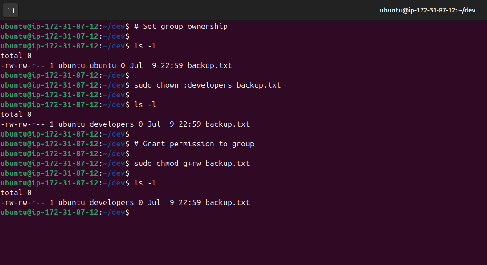

<!-- ABOUT THE PROJECT -->
## ADVANCED LINUX COMMANDS

### Objective

For this project, the following steps were taken to demonstrate advanced linux commands:

- [ADVANCED LINUX COMMANDS](#advanced-linux-commands)
  - [Objective](#objective)
    - [File Permissions and Access Rights](#file-permissions-and-access-rights)
      - [File Permissions](#file-permissions)
    - [File Permission Commands in Linux](#file-permission-commands-in-linux)
      - [chmod Command](#chmod-command)
      - [chown Command](#chown-command)
      - [sudo Command](#sudo-command)
      - [User Management in Linux](#user-management-in-linux)
      - [Creating a User](#creating-a-user)
    - [Change User's Password](#change-users-password)
      - [passwd Command](#passwd-command)
    - [Creating a Group](#creating-a-group)
      - [groupadd Command](#groupadd-command)
    - [Deleting a User](#deleting-a-user)
      - [userdel Command](#userdel-command)
    - [File and Directory Group](#file-and-directory-group)
    - [Demonstration of User Management](#demonstration-of-user-management)

----

#### File Permissions and Access Rights

##### File Permissions

A linux file permission can be displayed in a numerical or symbolic format.
The display of file permission in symbolic format shows 10 characters with the first character 
indicating either a file(-) or directory(d). The subsequent sequence of next 3 characters represent the owner permission.
The next 3 characters represent the group permission and the last 3 characters represent the others permission.

Run the **ls** command with the ***latr*** flags.


----

#### File Permission Commands in Linux

##### chmod Command

It is used to modify file permissions.
The linux file permission can be modified using either:

symbolic pattern ``` chmod +x script.sh```

or

numeric approach ```chmod 755 script.sh```


----

##### chown Command

It is used to change the ownership of files, directories or symbolic links to 
a specified user or group.

```chown [option] owner[:group] file(s)```


----


##### sudo Command

It is used to have access to superuser privileges to perform some tasks.

```sudo -i```



----

##### User Management in Linux

##### Creating a User

The ***adduser*** command is used to create a new user on a linux system.

```sudo adduser [userName]```


Grant user administrative privileges with the command
```sudo usermod -aG sudo johndoe```

It is used to have access to superuser privileges to perform some tasks.

```sudo -i```


Explore the home directory of the new user.


----

#### Change User's Password

##### passwd Command

It is used to change the password of a user.

```sudo passwd [userName]```


----


#### Creating a Group

##### groupadd Command

It is used to create a new group.

```sudo groupadd [groupName]```



Add user to the group.


----


#### Deleting a User

##### userdel Command

It can be used to delete a user

```sudo userdel [userName]```


----

#### File and Directory Group

A file or directory can be assigned to a group using ***chown*** command.

The group permission for a file or directory can be set using ***chmod*** command.



----

#### Demonstration of User Management

This involves creation of a **devops** group.


Afterwards, 5 users are created which are assigned to the group ***devops***.

Explore the home directory of the new user.

**mary**


**mohammed**


**ravi**


**tunji**


**sofia**


